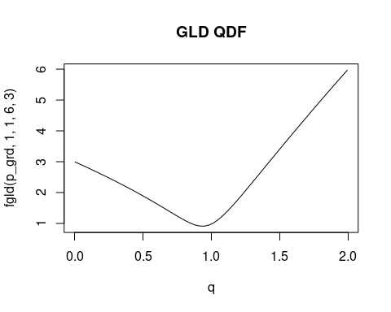
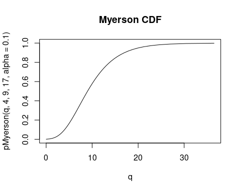

<!-- README.md is generated from README.Rmd. Please edit that file -->

# `qpd` <a href='https://dmi3kno.github.io/qpd'></a>

<!-- badges: start -->
<!-- badges: end -->

The goal of `qpd` is to provide essential functions and tools for using
quantile and quantile-parameterized distributions in Bayesian analysis
in R.

## Installation

You can install the development version of `qpd` from
[GitHub](https://github.com/dmi3kno/qpd) with:

``` r
# install.packages("remotes")
remotes::install_github("dmi3kno/qpd")
```

## Quantile distributions and quantile-parameterized distributions

Most people consider cumulative distribution function to be the
fundamental way of defining a distribution (there’s a reason it is often
simply called a *distribution function*). Some even believe that PDF is
the only correct way to define a distribution. But equally plausible way
to define a distribution is via the inverse cumulative distribution
function, also know as the *quantile function*. Distributions defined by
non-analytically-invertible quantile function are called *quantile
distributions* (Gilchrist 2000; Parzen 2004; Perepolkin, Goodrich, and
Sahlin 2021b).

Quantile-parameterized distributions (often also defined by a
non-invertible quantile function) use special kind of parameterization:
a vector of cumulative probabilities *p* and a vector of corresponding
quantiles *q* (e.g. *p* = {0.1, 0.5, 0.9}, *q* = {4, 9, 17} is a valid
parameterization) (Keelin and Powley 2011; Hadlock 2017).


## Examples

The following example shows how to solve a common problem.

``` r
library(qpd)
```

### Probability grids

When working with quantile distributions it is often convenient to use
regularly spaced grids of probability values, because quantile values
take probabilities (also referred to as *depths*) *p* and output the
quantile values *q* given the parameters. `qpd` provides a couple of
convenience functions for creating regularly spaced probability grids.
`make_pgrid()` creates “a smooth” S-shaped grid, denser toward the tails
and sparser in the middle. `make_tgrid()` creates linear (equispaced)
with several tiers. Certain part of the grid (defined by `tail`)
argument is also split into linear grid, forming an S-shaped
piecewise-linear grid. Curvature of the grid is controlled by
parameters.

``` r
p_grd <- make_pgrid()
plot(p_grd, type="l", main="P-grid using beta QF")
t_grd <- make_tgrid()
plot(t_grd, type="l", main="Tiered grid (3 tiers)")
```


### Quantile distributions

The package contains standard distribution functions for the following
quantile distributions: GLD, g-and-h, g-and-k, Govindarajulu, Wakeby.

### Generalized Lambda Distribution (GLD)

``` r
q <- qpd::qgld(p_grd, 1, 1, 6, 3)
plot(q~p_grd, type="l", main="GLD QF")
plot(pgld(q, 1,1,6,3)~q, type="l", main="GLD CDF (approx iQF)")
plot(fgld(p_grd, 1, 1, 6, 3)~q, type="l", main="GLD QDF")
plot(dqgld(p_grd, 1, 1, 6, 3)~q, type="l", main="GLD DQF")
```



### Generalized g-and-h distribution

``` r
q <- qpd::qgnh(p_grd,  3, 1, 0.8, 2, 0.5)
plot(q~p_grd, type="l", main="g-and-h QF")
plot(pgnh(q, 3, 1, 0.8, 2, 0.5)~q, type="l", main="g-and-h CDF (approx iQF)")
plot(fgnh(p_grd, 3, 1, 0.8, 2, 0.5)~q, type="l", main="g-and-h QDF")
plot(dqgnh(p_grd, 3, 1, 0.8, 2, 0.5)~q, type="l", main="g-and-h DQF")
```


### Govindarajulu distribution

``` r
q <- qpd::qgovindarajulu(p_grd,  4, 2.2)
plot(q~p_grd, type="l", main="Govindarajulu QF")
plot(pgovindarajulu(q, 4, 2.2)~q, type="l", main="Govindarajulu CDF (approx iQF)")
plot(fgovindarajulu(p_grd, 4, 2.2)~q, type="l", main="Govindarajulu QDF")
plot((qpd::dqgovindarajulu(p_grd, 4, 2.2))~q, type="l", main="Govindarajulu DQF")
```


### Wakeby distribution

``` r
q <- qpd::qwakeby(p_grd,  5, 3, 0.1, 0.2, 0)
plot(q~p_grd, type="l", main="Wakeby QF")
plot(pwakeby(q, 5, 3, 0.1, 0.2, 0)~q, type="l", main="Wakeby CDF (approx iQF)")
plot(fwakeby(p_grd, 5, 3, 0.1, 0.2, 0)~q, type="l", main="Wakeby QDF")
plot((qpd::dqwakeby(p_grd, 5, 3, 0.1, 0.2, 0))~q, type="l", main="Wakeby DQF")
```


## Quantile-parameterized distributions

The package implements standard distribution functions for the following
quantile-parametrized distributions: Myerson, SkewNormal (special case
of Myerson distribution), J-QPD and metalog distribution.

### Myerson distribution

Myerson is a Normal-based probability distribution, therefore its
quantile function builds on the Normal quantile function.

``` r
q <- qpd::qMyerson(p_grd,  4,9,17, alpha=0.1)
plot(q~p_grd, type="l", main="Myerson QF")
plot(pMyerson(q, 4,9,17, alpha=0.1)~q, type="l", main="Myerson CDF")
plot(qpd::dMyerson(q, 4,9,17, alpha=0.1)~q, type="l", main="Myerson PDF")
```


\#\# Skew-Normal distribution

Quantile-parametrized Skew-Normal is a special case of Myerson
distribution

``` r
q <- qpd::qSkewNorm (p_grd,  4,17, s=-0.3)
plot(q~p_grd, type="l", main="Skew-Normal QF")
plot(pSkewNorm(q, 4,17, s=-0.3)~q, type="l", main="Skew-Normal CDF")
plot(qpd::dSkewNorm(q,4,17, s=-0.3)~q, type="l", main="Skew-Normal PDF")
```


## Metalog distribution

Fitting metalog distribution (Keelin 2016) a metalog distribution
requires calculation of *a* coefficients which can be passed to all
functions. It is a good idea to check whether the resulting metalog is
valid.

``` r
as <- qpd::fit_metalog(p=c(0.1, 0.5, 0.9, 0.99), q=c(4,9,17, 22), bl=0)
is_metalog_valid(as, bl=0)
#> [1] TRUE
q <- qpd::qmetalog(p_grd,  as, bl=0)
plot(q~p_grd, type="l", main="Metalog (4-terms) QF")
plot(pmetalog(q, as, bl=0)~q, type="l", main="Metalog (4-terms) CDF (approx iQF)")
plot(fmetalog(p_grd, as, bl=0)~q, type="l", main="Metalog (4-terms) QDF")
plot((qpd::dqmetalog(p_grd, as, bl=0))~q, type="l", main="Metalog (4-terms) DQF")
```


## Other functionality

`qpd` can also fit (using conditional beta distributions) and sample
from Dirichlet and Connor-Mosimann distributions (Perepolkin, Goodrich,
and Sahlin 2021a). There are also functions for proxy fitting Chebyshev
polynomials to arbitrary functions and automatic checking of roots for a
user-defined quantile density function (Perepolkin, Goodrich, and Sahlin
2021b). The package also has quantile versions of density (DQF and QDF)
for some standard distributions, including normal, exponential,
Rayleigh, and generalized exponential. There’s also fixed-seed HDR
pseudo-random number generator.

## References

<div id="refs" class="references csl-bib-body hanging-indent">

<div id="ref-gilchrist2000StatisticalModellingQuantile"
class="csl-entry">

Gilchrist, Warren. 2000. *Statistical Modelling with Quantile
Functions*. Boca Raton: Chapman & Hall/CRC.

</div>

<div id="ref-hadlock2017QuantileparameterizedMethodsQuantifying"
class="csl-entry">

Hadlock, Christopher Campbell. 2017. “Quantile-Parameterized Methods for
Quantifying Uncertainty in Decision Analysis.” Thesis, Austin, TX:
University of Texas. <https://doi.org/10.15781/T2F18SX41>.

</div>

<div id="ref-keelin2016MetalogDistributions" class="csl-entry">

Keelin, Thomas W. 2016. “The Metalog Distributions.” *Decision Analysis*
13 (4): 243–77. <https://doi.org/f9n7nt>.

</div>

<div id="ref-keelin2011QuantileParameterizedDistributions"
class="csl-entry">

Keelin, Thomas W., and Bradford W. Powley. 2011. “Quantile-Parameterized
Distributions.” *Decision Analysis* 8 (3): 206–19.
<https://doi.org/10.1287/deca.1110.0213>.

</div>

<div id="ref-parzen2004QuantileProbabilityStatistical"
class="csl-entry">

Parzen, Emanuel. 2004. “Quantile Probability and Statistical Data
Modeling.” *Statistical Science* 19 (4): 652–62.
<https://doi.org/dk6284>.

</div>

<div id="ref-perepolkin2021HybridElicitationIndirect" class="csl-entry">

Perepolkin, Dmytro, Benjamin Goodrich, and Ullrika Sahlin. 2021a.
“Hybrid Elicitation and Indirect Bayesian Inference with
Quantile-Parametrized Likelihood.” OSF Preprints.
<https://doi.org/10.31219/osf.io/paby6>.

</div>

<div id="ref-perepolkin2021TenetsIndirectInference" class="csl-entry">

———. 2021b. “The Tenets of Indirect Inference in Bayesian Models.”
Preprint. https://osf.io/enzgs: Open Science Framework.
<https://doi.org/10.31219/osf.io/enzgs>.

</div>

</div>
